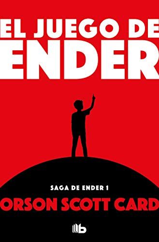

# El juego de Ender

## Sinopsis
En un futuro lejano, la humanidad se encuentra en una guerra contra una raza alienígena llamada los Insectores. Ante la amenaza de la extinción, la Federación Internacional de la Tierra entrena a niños superdotados en la Academia de Batalla para prepararlos como líderes militares y estrategas.

Ender Wiggin, un niño de seis años, es seleccionado por el Coronel Graff para entrenar en la Academia de Batalla, debido a su inteligencia y habilidades únicas. Allí, Ender es sometido a rigurosas pruebas físicas y mentales, incluyendo simulaciones de batalla en las que debe liderar a sus compañeros para derrotar a los enemigos.

A medida que Ender avanza en su entrenamiento, comienza a cuestionar las verdaderas intenciones de sus superiores y la moralidad de la guerra. También se enfrenta a problemas personales, como la relación tensa con su hermano mayor Peter y su hermana cariñosa Valentine.

Cuando Ender es enviado al espacio para continuar su entrenamiento, descubre la verdad detrás de sus pruebas y el papel que se espera que desempeñe en la guerra contra los Insectores. Ender debe decidir si seguir las órdenes de sus superiores y convertirse en un héroe militar, o tomar su propio camino y luchar por la verdad y la justicia.