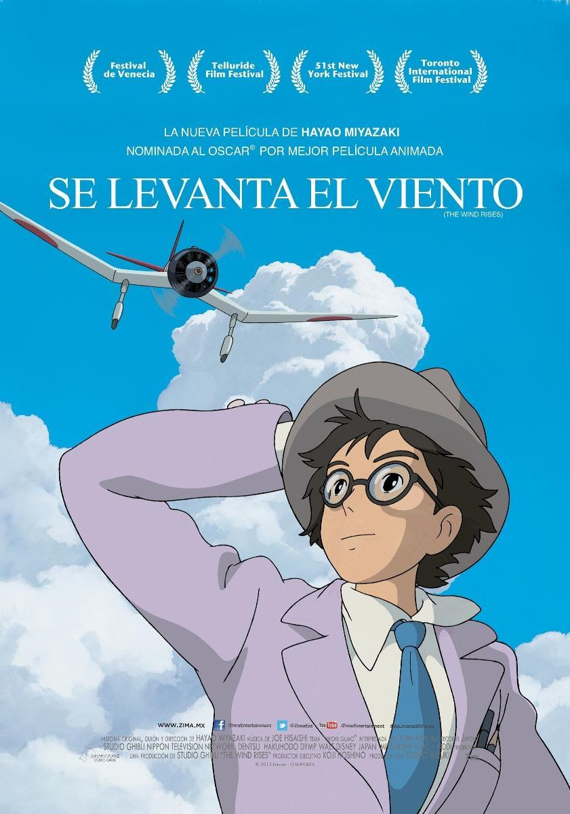

# Se levanta el viento

## Sinopsis

"El viento se levanta" es una película animada del estudio Ghibli, dirigida por Hayao Miyazaki. La historia sigue la vida de Jiro Horikoshi, un ingeniero aeronáutico que diseñó muchos aviones japoneses durante la Segunda Guerra Mundial, incluyendo el famoso Mitsubishi A6M Zero.

La película comienza con Jiro de niño, quien sueña con volar y convertirse en un piloto de avión, pero debido a su mala vista, se da cuenta de que nunca podrá cumplir su sueño. En cambio, decide dedicarse a diseñar aviones y se convierte en un talentoso ingeniero.
