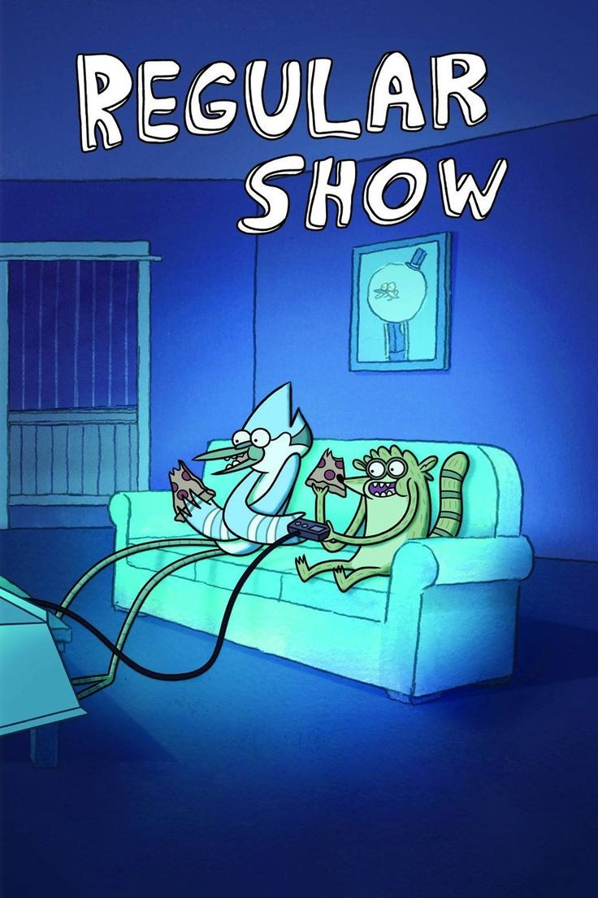

# Un Show Más

## Sinopsis
La serie sigue a Mordecai, un arrendajo azul, y Rigby, un mapache, quienes trabajan juntos como conserjes en un parque. A pesar de su trabajo, los dos amigos prefieren pasar el tiempo jugando videojuegos y haciendo travesuras en lugar de trabajar.

A lo largo de la serie, Mordecai y Rigby se meten en todo tipo de problemas y situaciones absurdas, desde enfrentar a una máquina expendedora malvada hasta viajar en el tiempo para recuperar un control remoto perdido. También tienen que lidiar con sus jefes, Benson, un hombre malhumorado, y Skips, un yeti místico, así como con sus amigos y compañeros de trabajo, como Pops, un hombre con cabeza de piruleta, y Musculoso, un hombre obeso y musculoso.

La serie está llena de referencias a la cultura pop, la música y los videojuegos, y a menudo presenta elementos sobrenaturales y de ciencia ficción.
