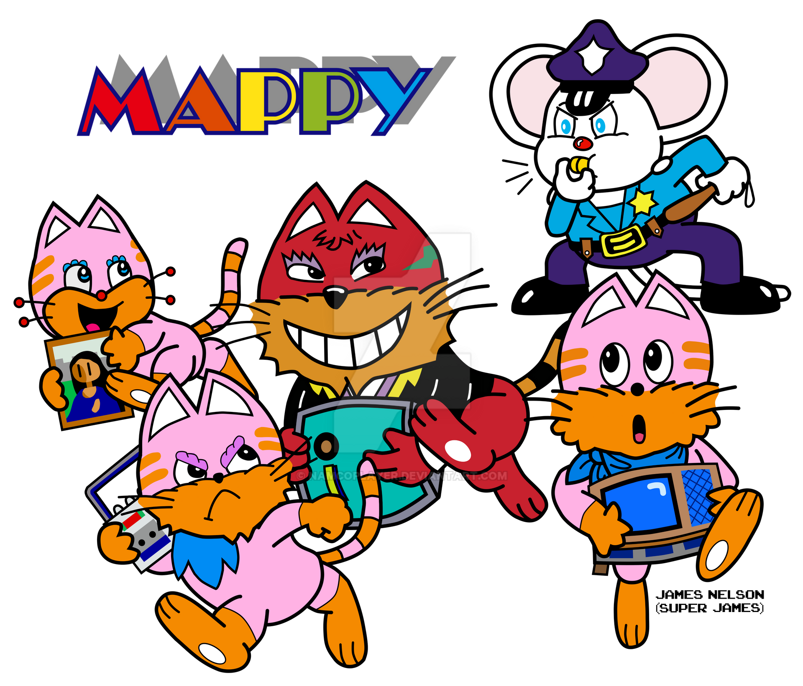

# Mappy

## Sinopsis
El jugador controla a un ratón antropomórfico llamado Mappy, quien trabaja como policía en una casa que está siendo invadida por una pandilla de gatos malvados llamados los Gatos Meowky.

El objetivo de Mappy es recuperar una serie de objetos robados por los Gatos Meowky y devolverlos a sus lugares correctos en la casa. Para hacerlo, Mappy debe saltar y correr por las plataformas de la casa mientras evita a los gatos y activa trampas para detenerlos.

El juego presenta una mecánica de juego única en la que el jugador debe saltar sobre los resortes que se encuentran en las plataformas para evitar a los gatos o hacerlos caer a niveles inferiores. El jugador también puede recolectar elementos especiales que le permiten atacar a los gatos o aumentar su puntuación.

A medida que el jugador avanza en el juego, los niveles se vuelven más difíciles y los gatos más astutos, lo que aumenta la dificultad del juego. El objetivo final es recuperar todos los objetos robados y derrotar al jefe final, el líder de los Gatos Meowky.