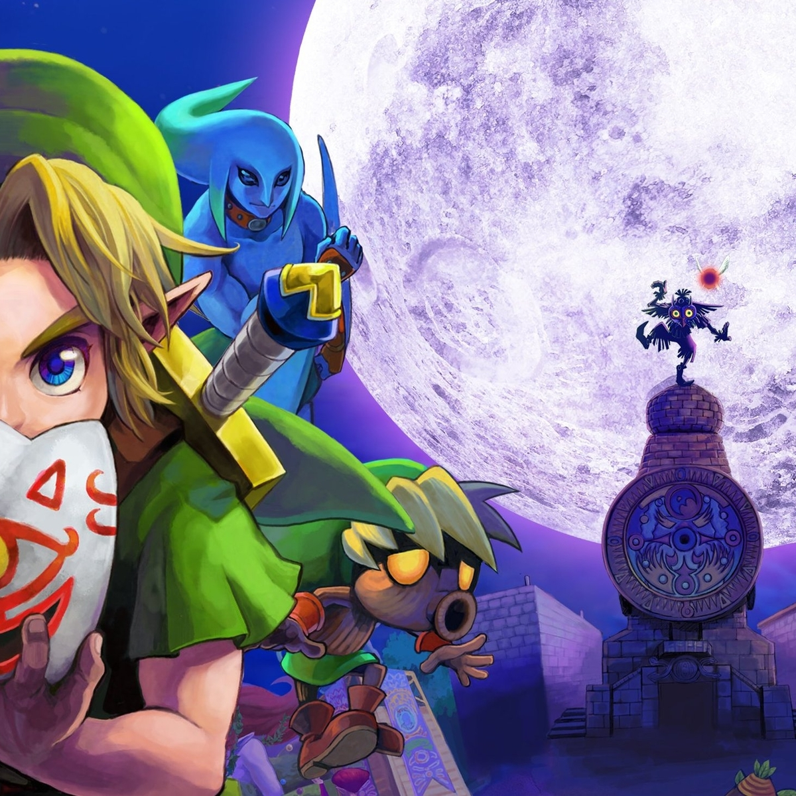

# La leyenda de Zelda Majoras Mask

## Sinopsis
La historia sigue a Link, el héroe de la leyenda de Zelda, quien es transportado a un nuevo mundo llamado Termina.

En Termina, Link descubre que la luna está cayendo hacia el mundo y que tiene solo tres días para detenerla. En su camino, conoce a una variedad de personajes y aprende que un malvado ser llamado Skull Kid ha robado una máscara antigua y poderosa llamada Majora's Mask. Skull Kid ha utilizado la máscara para convocar a la luna y amenaza con destruir Termina.

Link debe viajar por Termina, adquiriendo nuevas habilidades y objetos a medida que se acerca a la confrontación final con Skull Kid. Sin embargo, hay una complicación adicional: el tiempo no se detiene. Cada ciclo de tres días, la luna sigue acercándose, lo que significa que Link debe encontrar una manera de viajar en el tiempo para seguir avanzando en su misión.