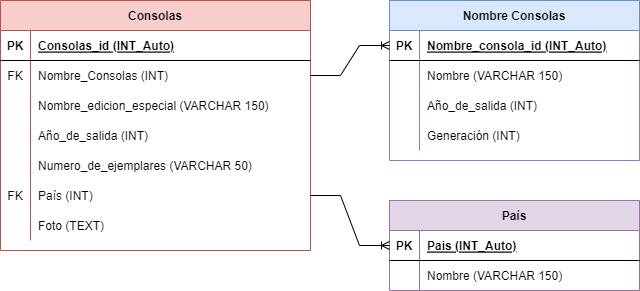

# Consolas de videojuegos Edición Especial

## Listado de Entidades

**Consolas de videojuegos (ED)**

- Consola_id **(PK)**
- Nombre_consola **(FK)**
- Nombre_edición_especial
- Año_de_salida
- Número_de_ejemplares
- Foto
- Pais **(FK)**

**Nombre_consola (EC)**
- Nombre_consola_id **(PK)**
- Nombre
- Generación
- Año_de_salida

**Pais (EC)**
- Pais_id **(PK)**
- Nombre

## Relaciones

1. Una **Consola** tiene un **nombre de consola** (M a 1).
1. Una **consola** se fabrica en un **país** (1 a M).

## Diagrama 

**Modelo Entidad - Relación**

**Modelo Relacional de la BD**

## Reglas de negocio

**Consolas de videojuegos**

1. Crea una consola de edición especial.
1. Leer todas las consolas de edición especial.
1. Leer una consola edición especial en particular.
1. Leer todas las consolas de edición especial de un tipo de consola en especifico.
1. Actualizar una consola de edición especial.
1. Eliminar una consola de edición especial.

**Nombre de Consolas**
1. Crear una consola.
1. Leer todas las consolas.
1. Leer una consola en particular.
1. Leer las consolas por generación.
1. Actualizar una consola.
1. Eliminar una consola.

**Paises**
1. Crear un pais.
1. Leer todos los paises.
1. Leer un país en particular.
1. Actualizar un país.
1. Eliminar un país.